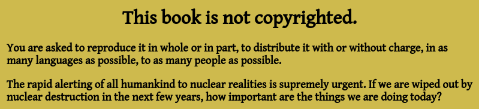

During the government shutdown in January of 2019, I wanted to teach myself to 
use vim as an editor. I had been gifted this book [The Hundredth Monkey](https://www.goodreads.com/book/show/252067.The_Hundredth_Monkey) and 
spent the time to type all of the pages into a single file.
I then used python to split the pages into markdown files, which can easily be 
structured into content using [GraphQL](https://graphql.org/).

### [checkout the site here!](https://www.rickdebbout.com/hundredth_monkey/)



Markdown files can be used to create content with gatsby's 
"gatsby-transformer-remark" plugin. I added the slider for navigation, but the 
book can be read pretty quickly. Here's a clip of the string parsing that I 
used in python to accomplish the task...

```python
import os

f = open("hundredth_monkey.txt", "r")
contents = f.read()
pages = contents.split("/**/")[3:-1]

for count, page in enumerate(pages, 7):
    # Capitalize first letter
    cap, idx = (page[4:6], 5) if page[4] == '"' else (page[4], 6)
    big = f'<span style="font-size:47px;">{cap}</span>'
    body =  ''.join((page[:4],big,page[idx:]))
    msg = ''
    if '+NUCLEAR' in body:
        body, msg = body.split('+NUCLEAR WAR IS BAD FOR')
        msg = msg.replace('\n','').strip()
    # add the frontmatter to the top
    final = (
        "---\n"
        f"previous: '/page-{count-1}'\n"
        f"next: '/page-{count+1}'\n"
        f"monkey_msg: '{msg}'\n"
        "---\n"
        f"{body}"
    )
    with open(f"md/page-{count}.md","w") as f:
        f.write(final)
```
